# 🚀 Hyper-V to Azure Migration Lab

**End-to-end migration-engineer lab: a nested Hyper-V "on-premises" environment built entirely inside an Azure VM, running a live 2-tier app (IIS web front end + SQL Server database), then discovered, assessed, and migrated to native Azure infrastructure using Azure Migrate.**


---

## 📖 Table of Contents

- [Project Overview](#-project-overview)
- [Architecture](#-architecture)
- [Tech Stack](#-tech-stack)
- [Prerequisites](#-prerequisites)
- [Phase 1 — Create the Hyper-V Host in Azure](#phase-1--create-the-hyper-v-host-in-azure)
- [Phase 2 — Connect & Enable Nested Virtualization](#phase-2--connect--enable-nested-virtualization)
- [Phase 3 — Build the SQL Server VM (SQL01)](#phase-3--build-the-sql-server-vm-sql01)
- [Phase 4 — Build the Web Server VM (WEB01)](#phase-4--build-the-web-server-vm-web01)
- [Phase 5 — Configure Internal Networking](#phase-5--configure-internal-networking)
- [Phase 6 — Install & Configure SQL Server (EmployeeDB)](#phase-6--install--configure-sql-server-employeedb)
- [Phase 7 — Install IIS and Deploy the Employee Portal](#phase-7--install-iis-and-deploy-the-employee-portal)
- [Phase 8 — Prepare for Azure Migrate](#phase-8--prepare-for-azure-migrate)
- [Phase 9 — Deploy & Configure the Migrate Appliance](#phase-9--deploy--configure-the-migrate-appliance)
- [Phase 10 — Discover the Source Servers](#phase-10--discover-the-source-servers)
- [Phase 11 — Dependency Mapping](#phase-11--dependency-mapping)
- [Phase 12 — Run the Assessment](#phase-12--run-the-assessment)
- [Phase 13 — Enable Replication](#phase-13--enable-replication)
- [Phase 14 — Plan Migration Waves](#phase-14--plan-migration-waves)
- [Phase 15 — Run the Migration](#phase-15--run-the-migration)
- [Phase 16 — Validate the Target Environment](#phase-16--validate-the-target-environment)
- [Troubleshooting](#-troubleshooting)
- [Repository Structure](#-repository-structure)
- [Roadmap](#-roadmap)
- [Lessons Learned](#-lessons-learned)
- [Author](#-author)

---

## 🧭 Project Overview

Real migration practice needs a real data center — which most learners don't have. This lab solves that
by running a Hyper-V host **as an Azure VM itself** (nested virtualization), building a small 2-tier
application inside it, and then treating that as genuine "source" infrastructure for a full
**Azure Migrate** discovery → assessment → migration cycle.

| Component | Role | Details |
|---|---|---|
| `HVHOST01` | Nested Hyper-V host | Azure VM (Windows Server 2022) acting as the on-prem hypervisor |
| `WEB01` | Web tier | IIS-hosted Employee Portal |
| `SQL01` | Data tier | SQL Server Express, `EmployeeDB` database |
| Azure Migrate | Migration tooling | Discovery → Dependency Mapping → Assessment → Replication → Migration |

---

## 🏗️ Architecture

**Simulated on-premises environment** (what Azure Migrate "sees" as the source):

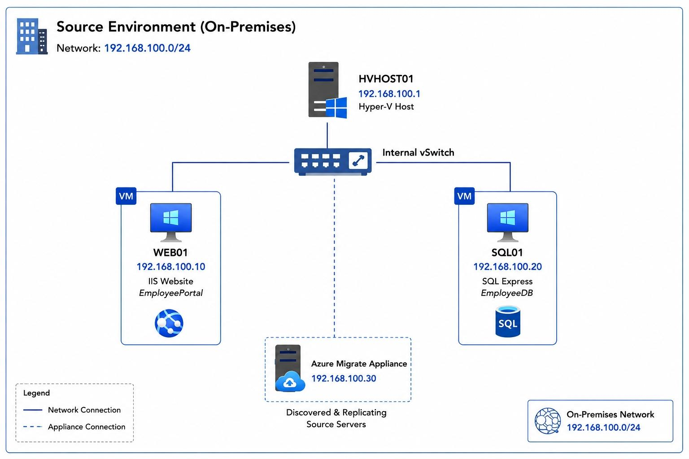

**Full lab-to-migration pipeline** (source → Migrate tooling → target Azure VMs):

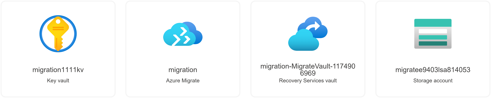

**Azure Migrated Environment layout** (Services running `WEB01` and `SQL01` on Azure):

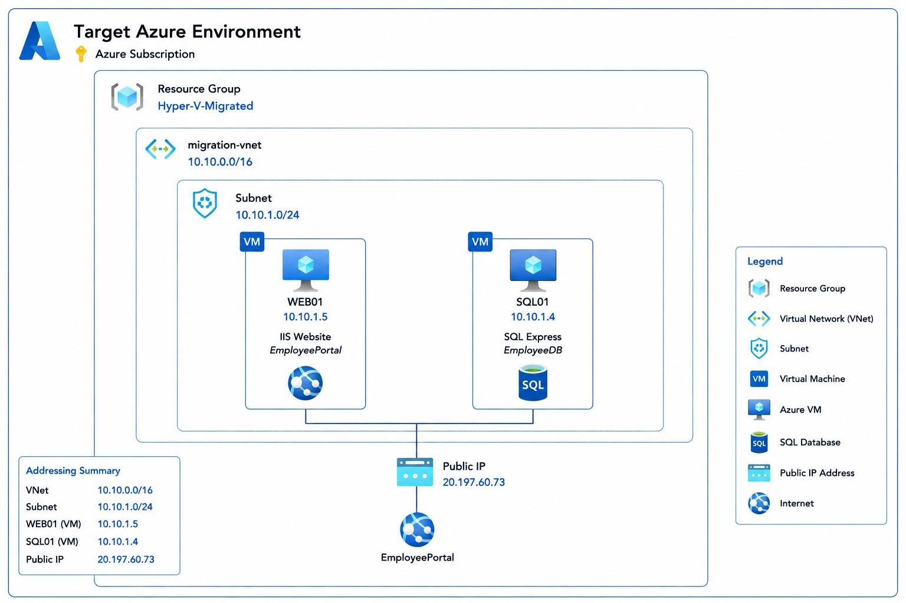

---

## 🧰 Tech Stack

- **Cloud:** Microsoft Azure (Azure for Students)
- **Virtualization:** Nested Hyper-V on Windows Server 2022
- **OS:** Windows Server 2022 Datacenter (host + guests)
- **Web tier:** IIS, ASP.NET
- **Data tier:** SQL Server Express 2022, SQL Server Management Studio (SSMS)
- **Migration tooling:** Azure Migrate — Discovery and assessment, Migration and modernization
- **Automation:** PowerShell (Hyper-V cmdlets, Windows Feature installation)

---

## ✅ Prerequisites

- An active **Azure for Students** subscription with available credits.
- Sufficient **vCPU quota** in your region for a 4-vCPU VM.
- Basic familiarity with the Azure Portal, RDP, PowerShell, and T-SQL.

```text
Component            Recommended Size          Fallback (if quota-limited)
------------------------------------------------------------------------------
Hyper-V Host         Standard_D4s_v5           Standard_D4as_v5 / Standard_D4s_v4
                      (4 vCPU / 16 GB RAM)
Web VM (WEB01)        2 vCPU / 4 GB RAM         -
SQL VM (SQL01)        2 vCPU / 4 GB RAM         -
```

> 💡 **Cost tip:** enable Auto-shutdown on `HVHOST01` (e.g., 8:00 PM local time) to conserve student credits.

---

## Phase 1 — Create the Hyper-V Host in Azure

### Step 1: Resource Group

```text
Resource Groups → + Create

Subscription     : Azure for Students
Resource Group   : RG-HyperV-Lab
Region           : East US
```

### Step 2: Virtual Network

```text
Virtual Networks → + Create

Subscription     : Azure for Students
Resource Group   : RG-HyperV-Lab
Name             : VNET-HyperV-Lab
Region           : East US

IP Addresses tab
Address Space    : 10.0.0.0/16
Subnet Name      : Subnet-HyperV
Subnet Range     : 10.0.1.0/24
```

### Step 3: Hyper-V Host VM (`HVHOST01`)

```text
Virtual Machines → + Create → Azure Virtual Machine

── Basics ──────────────────────────────────────
Subscription          : Azure for Students
Resource Group        : RG-HyperV-Lab
VM Name               : HVHOST01
Region                : East US
Availability options  : No infrastructure redundancy required
Security type         : Standard   (NOT Trusted Launch — breaks nested virtualization)
Image                 : Windows Server 2022 Datacenter (or Azure Edition)
VM Architecture        : x64
Size                  : Standard_D4s_v5  (4 vCPU, 16 GB RAM)
Username               : azureadmin
Password               : <your own strong password>
Inbound ports          : Allow selected ports → RDP (3389)

── Disks ───────────────────────────────────────
OS Disk Type           : Premium SSD  (Standard SSD if credits are low)
Encryption              : Default

── Networking ──────────────────────────────────
Virtual Network         : VNET-HyperV-Lab
Subnet                  : Subnet-HyperV
Public IP                : Create new → HVHOST01-PIP  (Standard SKU)
NIC NSG                  : Basic
Public inbound ports     : Allow selected ports → RDP (3389)

── Management ──────────────────────────────────
Boot diagnostics         : Enable (Managed storage account)
Auto-shutdown             : Enable → 8:00 PM → your local timezone

── Monitoring ──────────────────────────────────
Guest OS Diagnostics        : Disable
Application Health Monitor  : Disable

── Advanced ────────────────────────────────────
Keep everything default. Do NOT add extensions now.

── Tags (optional) ─────────────────────────────
Environment : MigrationLab

Review + Create → wait for "Validation Passed" → Create
Deployment usually takes 3–10 minutes.
```
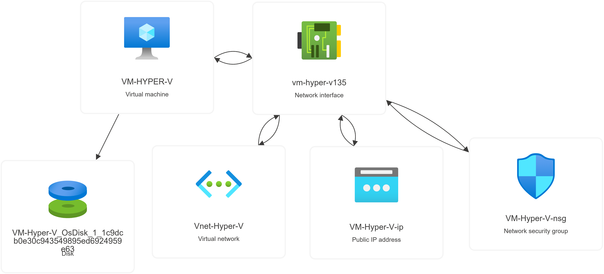

---

## Phase 2 — Connect & Enable Nested Virtualization

### Step 1: Connect via RDP

```text
Portal → HVHOST01 → Connect → RDP → download RDP file

Username : azureadmin
Password : <your password>
```

### Step 2: Check virtualization support

Open **PowerShell as Administrator** inside `HVHOST01`:

```powershell
systeminfo
```

Look for the `Hyper-V Requirements` section. On an Azure VM you'll commonly see:

```text
Hyper-V Requirements:
A hypervisor has been detected. Features required for Hyper-V will not be displayed.
```

### Step 3: Install the Hyper-V role

```powershell
Install-WindowsFeature Hyper-V -IncludeManagementTools -Restart
```

The VM restarts automatically.

### Step 4: Confirm installation

```powershell
Get-WindowsFeature Hyper-V
Get-VMHost
```

Expect `Installed : True` and a valid `Get-VMHost` response.

### Step 5: Create the internal virtual switch

```powershell
New-VMSwitch -Name "InternalLabSwitch" -SwitchType Internal
Get-VMSwitch
```

### Step 6: Create storage folders and stage the ISO

```powershell
mkdir C:\VMs
mkdir C:\ISO
```

Download the **Windows Server 2022 Evaluation ISO** from the Microsoft Evaluation Center and upload it
to `HVHOST01` as `C:\ISO\WS2022.iso`.

---

## Phase 3 — Build the SQL Server VM (SQL01)

```powershell
New-VM `
    -Name SQL01 `
    -MemoryStartupBytes 4GB `
    -NewVHDPath "C:\VMs\SQL01.vhdx" `
    -NewVHDSizeBytes 60GB `
    -Generation 2 `
    -SwitchName InternalLabSwitch

Set-VMProcessor -VMName SQL01 -Count 2

Set-VMDvdDrive -VMName SQL01 -Path "C:\ISO\WS2022.iso"

Start-VM SQL01
```

Connect via **Hyper-V Manager → Connect** and install Windows Server as usual.

---

## Phase 4 — Build the Web Server VM (WEB01)

```powershell
New-VM `
    -Name WEB01 `
    -MemoryStartupBytes 4GB `
    -NewVHDPath "C:\VMs\WEB01.vhdx" `
    -NewVHDSizeBytes 40GB `
    -Generation 2 `
    -SwitchName InternalLabSwitch

Set-VMProcessor -VMName WEB01 -Count 2

Set-VMDvdDrive -VMName WEB01 -Path "C:\ISO\SERVER_EVAL_x64FRE_en-us.iso"

Start-VM WEB01
```

---

## Phase 5 — Configure Internal Networking

On `HVHOST01`, assign the host-side gateway IP on the internal switch:

```powershell
Get-NetAdapter

New-NetIPAddress `
    -IPAddress 192.168.100.1 `
    -PrefixLength 24 `
    -InterfaceAlias "vEthernet (InternalLabSwitch)"
```

Then, inside each guest OS, assign static IPs:

```text
VM         IP Address          Gateway
------------------------------------------
WEB01      192.168.100.10      192.168.100.1
SQL01      192.168.100.20      192.168.100.1
```

---

## Phase 6 — Install & Configure SQL Server (EmployeeDB)

Inside `SQL01`, install **SQL Server Express 2022** and **SQL Server Management Studio (SSMS)**.

**Create the database:**

```sql
CREATE DATABASE EmployeeDB;
GO
```

**Create the table:**

```sql
USE EmployeeDB;
GO

CREATE TABLE Employees
(
    Id         INT PRIMARY KEY,
    Name       VARCHAR(100),
    Department VARCHAR(100),
    Salary     DECIMAL(10,2)
);
GO
```

**Insert sample data:**

```sql
INSERT INTO Employees (Id, Name, Department, Salary)
VALUES
    (1, 'Rajesh', 'Cloud',   50000),
    (2, 'Amit',   'Support', 35000),
    (3, 'Neha',   'HR',      45000),
    (4, 'Priya',  'DevOps',  60000);
GO
```

**Verify:**

```sql
SELECT * FROM Employees;
GO
```

```text
Id   Name     Department   Salary
------------------------------------
1    Rajesh   Cloud        50000.00
2    Amit     Support      35000.00
3    Neha     HR           45000.00
4    Priya    DevOps       60000.00
```

---

## Phase 7 — Install IIS and Deploy the Employee Portal

Inside `WEB01`:

```powershell
Install-WindowsFeature Web-Server -IncludeManagementTools
```

Verify at `http://localhost`, then create the site folder:

```text
C:\inetpub\wwwroot\EmployeePortal
```

Start with a static test page:

```html
<h1>Employee Portal</h1>
```

**Next milestone:** replace this with an ASP.NET page that connects to `SQL01`
(`192.168.100.20`), queries `EmployeeDB`, and renders live rows:

```text
ID    Name     Department
--------------------------
1     Rajesh   Cloud
2     Amit     Support
3     Neha     HR
4     Priya    DevOps
```

---

## Phase 8 — Prepare for Azure Migrate

With `WEB01` and `SQL01` up and running, create the Azure Migrate project:

```text
Azure Portal → Azure Migrate → Servers, databases and web apps → Create project

Subscription     : Azure for Students
Resource Group   : RG-HyperV-Lab
Project Name     : HyperV-Migration-Lab
Geography         : United States

Add tools: Migration and modernization + Discovery and assessment
```

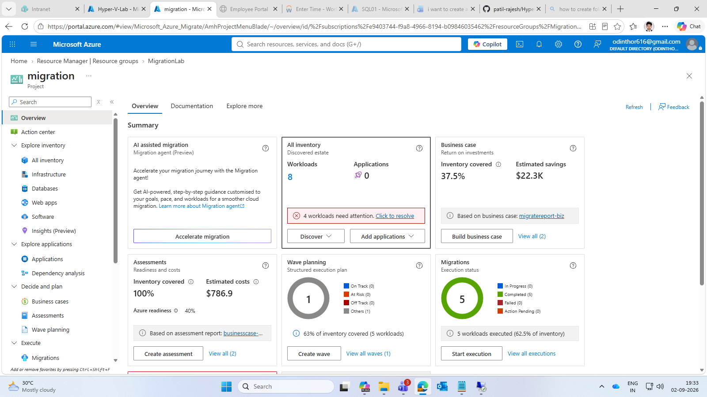

---

## Phase 9 — Deploy & Configure the Migrate Appliance

Deploy the Azure Migrate appliance as a nested VM inside `HVHOST01` (same process as `SQL01`/`WEB01`,
using the appliance VHD instead of a Windows ISO), then register it with the project:

```text
Discover → Are your servers virtualized? → Yes, with Hyper-V
Appliance Name       : migrate-appliance-01
Generate Key          → copy and store the registration key

Download appliance    : .VHD (recommended for Hyper-V sources)
Import into Hyper-V   → attach to InternalLabSwitch → start the VM
Browse to             : https://<appliance-name-or-ip>:44368
Configure             : time sync → install updates → set credentials
Register              : paste the project key generated above
```
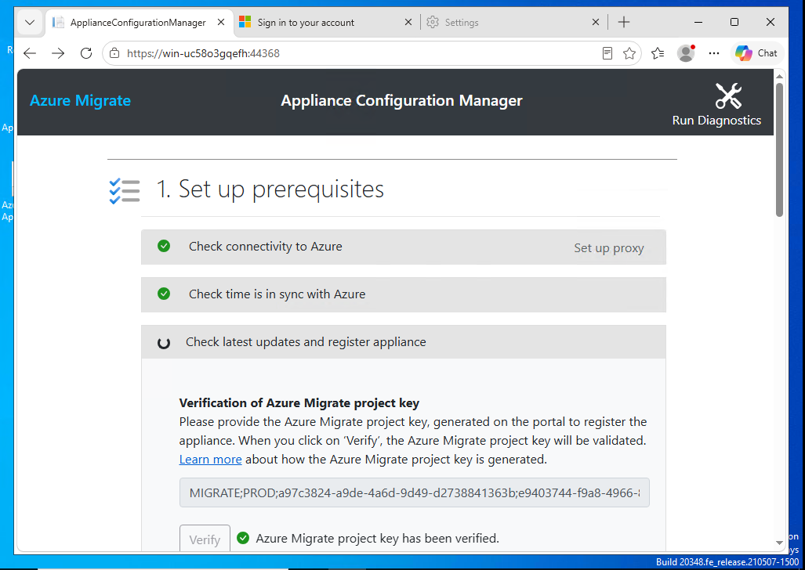

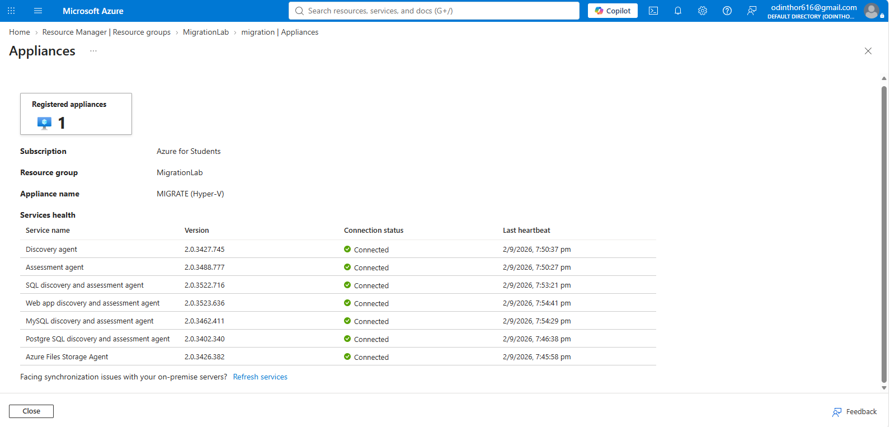

---

## Phase 10 — Discover the Source Servers

Once the appliance is registered, kick off discovery of `WEB01` and `SQL01`:

```text
Azure Migrate project → Discover → Start Discovery
Source                : Hyper-V hosts (via appliance)
Servers to discover    : WEB01, SQL01
```

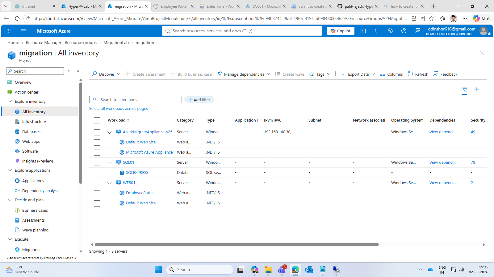

---

## Phase 11 — Dependency Mapping

Confirm the Web ↔ SQL relationship is correctly detected before assessing or migrating:

```text
Azure Migrate project → Servers → select WEB01 → Dependencies
Mapping should show    : WEB01 → SQL01 (port 1433, SQL traffic)
```

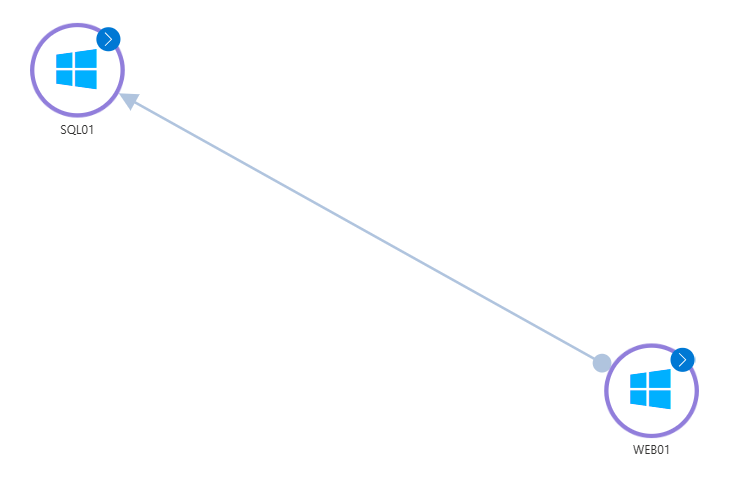

---

## Phase 12 — Run the Assessment

Generate a right-sizing and readiness assessment for both VMs:

```text
Azure Migrate project → Assess → Create assessment
Assessment type    : Azure VM
Servers             : WEB01, SQL01
Target region        : East US
Sizing criteria       : Performance-based
```

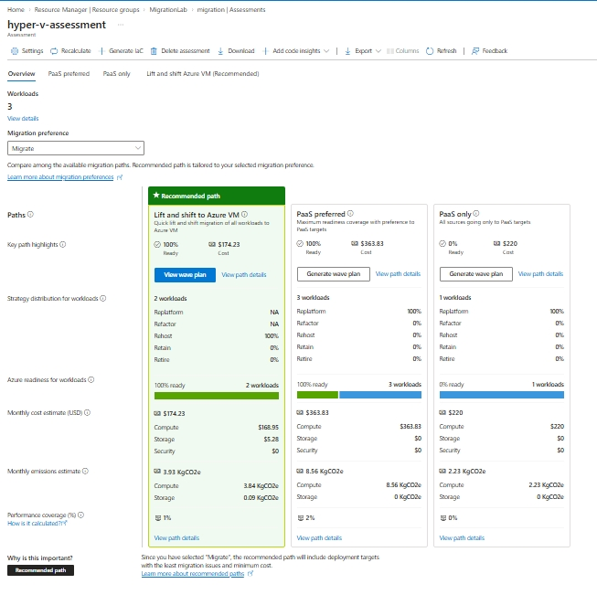

---

## Phase 13 — Enable Replication

Start replicating disk data for both VMs to Azure:

```text
Azure Migrate project → Migrate → Servers or virtual machines
Target                 : Azure VM
Servers                : WEB01, SQL01
Target resource group   : RG-HyperV-Lab (or a dedicated target RG)
Target virtual network   : VNET-HyperV-Lab
Replication storage      : default (auto-created cache storage account)
```

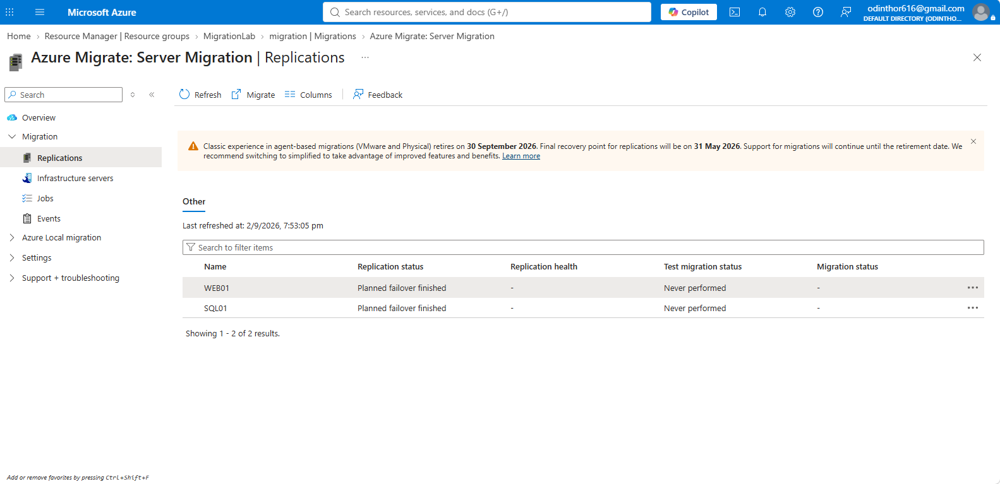

---

## Phase 14 — Plan Migration Waves

Group servers into a migration wave so the web and data tiers cut over together:

```text
Wave name        : Wave-1-EmployeePortal
Servers           : WEB01, SQL01
Cutover order      : SQL01 first, then WEB01
Scheduled window    : <your maintenance window>
```

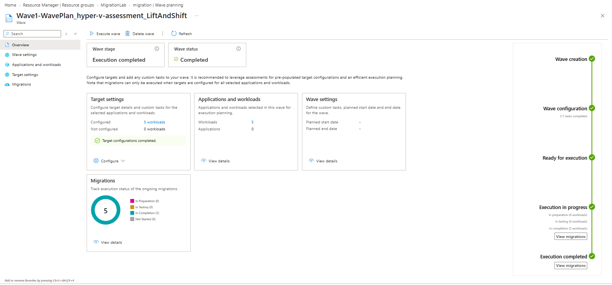

---

## Phase 15 — Run the Migration

Run a **test migration** first to validate in an isolated network, then perform the full cutover:

```text
Azure Migrate project → Replicating machines → select WEB01/SQL01
Test Migration    → validate in isolated VNet → clean up test VM
Migrate           → confirm no new changes are being replicated → Migrate
```

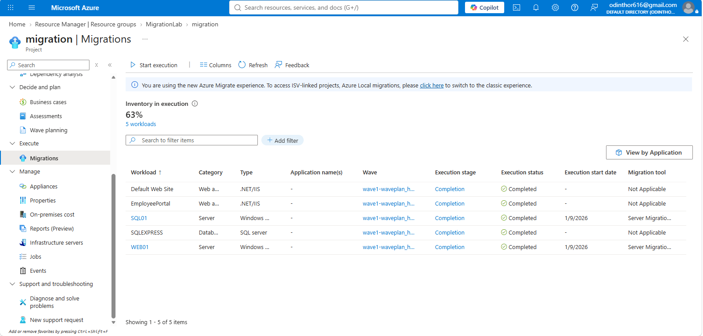

---

## Phase 16 — Validate the Target Environment

Confirm both VMs are running natively in Azure, the app works end-to-end, and clean up the source:

```text
Checklist:
[ ] WEB01 and SQL01 appear as native Azure VMs
[ ] Employee Portal loads and returns live rows from EmployeeDB
[ ] Network/NSG rules allow WEB01 → SQL01 (port 1433)
[ ] Source nested VMs powered off / deallocated
[ ] Migration project resources reviewed for ongoing cost
```

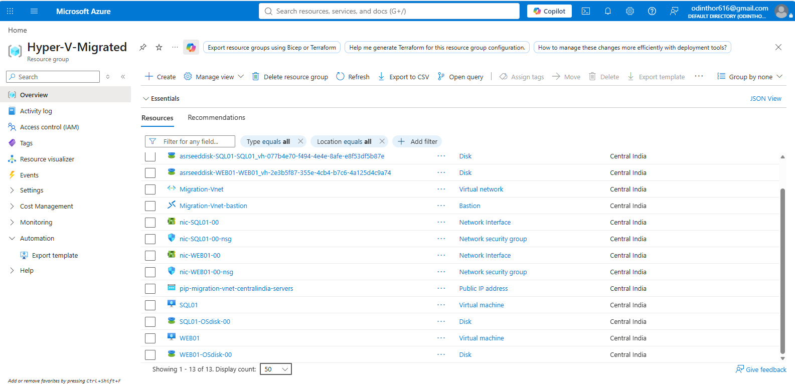

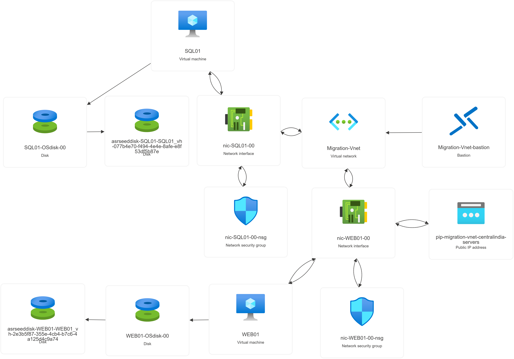

---

## 🩹 Troubleshooting

<details>
<summary><strong>"A hypervisor has been detected. Features required for Hyper-V will not be displayed."</strong></summary>

This is expected on an Azure VM and is generally a **good sign** — Windows detects it's already running
under a hypervisor (Azure's own virtualization layer), so it can't enumerate the underlying Hyper-V
requirement flags the normal way.

Verify nested virtualization is actually working with:

```powershell
Get-WindowsFeature Hyper-V
Get-VMHost
New-VM -Name TestVM -MemoryStartupBytes 1GB
Get-VM
```

If `TestVM` shows up with state `Off`, nested virtualization is functioning correctly.
</details>

<details>
<summary><strong>VM size not available in my region / student subscription</strong></summary>

Try, in order: `Standard_D4s_v5` → `Standard_D4as_v5` → `Standard_D4s_v4`. Student subscriptions often
have tighter regional quota — East US, East US 2, and Central US tend to have the best availability.
</details>

<details>
<summary><strong>Trusted Launch breaks nested VM creation</strong></summary>

Always select **Security Type: Standard** for `HVHOST01`. Trusted Launch enforces Secure Boot/vTPM
restrictions incompatible with nested virtualization.
</details>


## 🗺️ Roadmap

```text
[x] Provision HVHOST01 in Azure
[x] Enable nested virtualization + internal switch
[x] Build SQL01 and WEB01 nested VMs
[x] Install SQL Server Express + create EmployeeDB
[x] Install IIS + static test page
[x] Deploy and register the Azure Migrate appliance
[x] Run discovery + dependency mapping
[x] Run assessment
[x] Enable replication
[x] Plan migration waves
[x] Execute migration to native Azure VMs
[ ] Build ASP.NET Employee Portal with live SQL connectivity
[ ] Post-migration cost comparison (on-prem-simulated vs. native Azure)
```

---

## 🎓 Lessons Learned

- Azure VMs report Hyper-V requirement checks differently than bare-metal hosts because they're already
  virtualized — the "hypervisor detected" message is a pass, not a failure.
- **Security Type: Standard** (not Trusted Launch) is required for the host VM to support nested
  virtualization.
- Dependency mapping caught the WEB01 → SQL01 relationship automatically, which made grouping both
  servers into a single migration wave straightforward.
- Auto-shutdown schedules are essential for keeping a multi-VM nested lab within student credit limits.

---

## 👤 Author

**Rajesh Shankarrao Patil**
Cloud / Migration Engineering — hands-on Azure Migrate lab project.

---

*This project was documented and iterated with the help of an AI coding assistant; all infrastructure
was built and validated hands-on in a live Azure Student subscription.*
